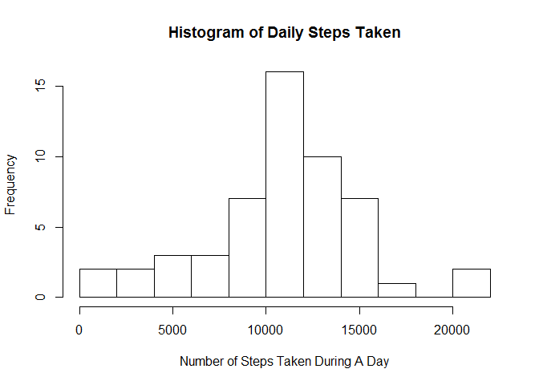
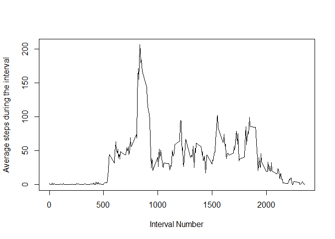
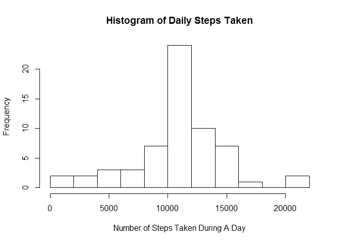
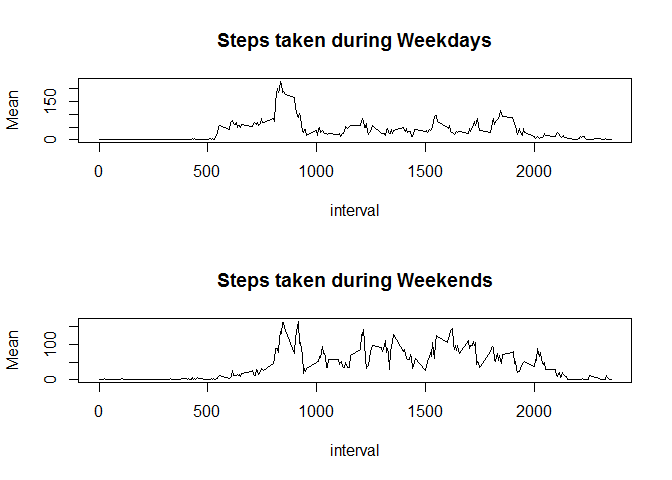

# Peer Assessment 1
AA  
Saturday, April 18, 2015  

# Summary of steps taken per day


```r
# Set up the right environment 
    setwd('c:/Users/AA/Documents/Coursera')
    setwd('Data Science/Reproducible Research//Code/PeerAssessment 1/')

# Read data from the local directory
    data = read.csv('activity.csv') 

# Summarize using the plyr library, ignoring NA's
    library(plyr)
    totStep = ddply(data[complete.cases(data),], ~date, 
                    summarize, Total=sum(steps))
    meanOfDays = mean(totStep$Total)
    medianOfDays = median(totStep$Total)

# Plot the data
hist(totStep$Total, main = "Histogram of Daily Steps Taken",
     xlab = 'Number of Steps Taken During A Day', breaks = 10)
```

 

The mean of daily steps is 1.0766189\times 10^{4}.  
The median of daily steps is 10765.

# Average Daily Activity Pattern

```r
    stepByInterval = ddply(data[complete.cases(data),], ~interval, 
                    summarize, Mean=mean(steps))
    plot(stepByInterval, type='l', 
            xlab = 'Interval Number', ylab='Average steps during the interval')
```

 

```r
    highestRow = which.max(stepByInterval[,2])
    highestInterval =  stepByInterval[highestRow, 1]
    highestSteps = stepByInterval[highestRow, 2]
```

The highest average is 206.1698113 in the interval 835.

# Inputting Missing Values

```r
missingValues = nrow(data) - nrow(data[complete.cases(data),])
```

There are 2304 entries with missing values.


```r
# Clean up the data by replacing NA's with the average for the
# interval across all days, and storing in cleanData
    cleanData = data
    for ( i in 1:nrow(data)) {
        if (is.na(data[i,1])) {  # Process each row with na
            int = data[i, 3]     # Determine the interval #
            stepRow = which(stepByInterval$interval == int) # Get int list row# 
            cleanData[i, 1] = stepByInterval[stepRow, 2] # Update the clean row
        }
    }

# Summarize the clean data by intervals
    totStep = ddply(cleanData, ~date, summarize, Total=sum(steps))
    meanOfCleaned = mean(totStep$Total)
    medianOfCleaned = median(totStep$Total)

# Plotting the data

    hist(totStep$Total, main = "Histogram of Daily Steps Taken",
         xlab = 'Number of Steps Taken During A Day', breaks = 10)
```

 

The graphs for the data with missing values, and of the cleaned up data,
replaced missing values with that interval's averages across days is a little
more peaked - the peak is higher and the other values are lower. This
is due to the fact that we have replaced all missing values with average,
so the number of entries at the average (which shows up as peak in the
graph) is higher, by proportion reducing the others. 

The actual mean is 1.0766189\times 10^{4} and the median is 1.0766189\times 10^{4}.

# Weekdays vs. Weekends

```r
# Add another column - called weekday to cleanData - giving the day of the week
    cleanData['weekday'] = weekdays(as.Date(cleanData$date))

# Replace the day of the week with "weekday" or "weekend"
    for (i in 1:nrow(cleanData)) {
        if (cleanData[i, 4] == 'Saturday' | cleanData[i, 4] == 'Sunday' ) {
            cleanData[i, 4] = 'weekend'
        }
        else {
            cleanData[i, 4] = 'weekday'
        }
    }

# Separate into two different data sets - weekdayData and weekendData
    weekdayData = cleanData[cleanData$weekday == 'weekday',]
    weekendData = cleanData[cleanData$weekday == 'weekend',]

#Summarize the two datasets
    weekdaySteps = ddply(weekdayData, ~interval, summarize, Mean=mean(steps))
    weekendSteps = ddply(weekendData, ~interval, summarize, Mean=mean(steps))

# Plot the two datasets on the same panel
    par(mfcol = c(2, 1))
    plot(weekdaySteps, type='l', main='Steps taken during Weekdays' )
    plot(weekendSteps, type='l', main='Steps taken during Weekends')
```

 

It looks like during weekdays people don't walk as much as during weekends in 
general. While the weekday peak is higher, there are many more local peaks
during weekdays.


